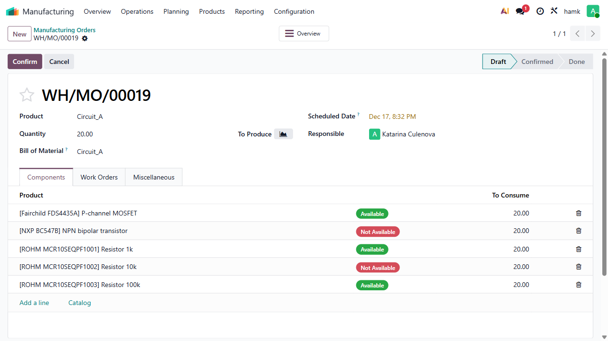
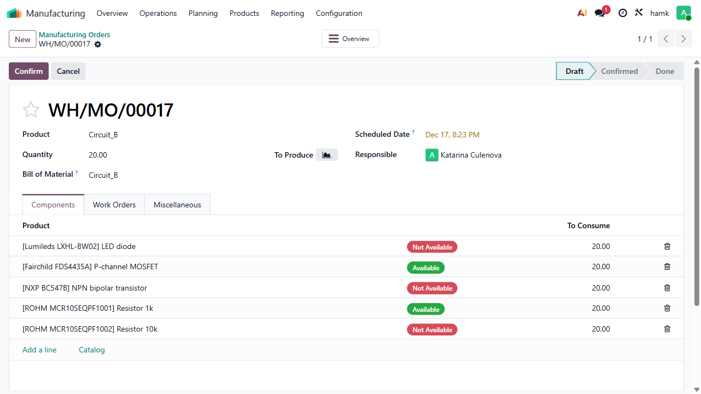

# Robotic Process Automation Project
Sebasatian Szetela - Getzko - amk1009882@student.hamk.fi
Katarína Čulenová - katuska-10 - amk1010416@student.hamk.fi
## Reflection
Combining the knowledge attained from lectures and plenty of mandatory assingments, this project proved to be way easier of a task than the previous 'test automation' project in our opinion. It still took us several days to finish, but we learnt a lot during this time.

Sometimes we found mismatching inspect tool locators for example; between Opera GX and Firefox. But usually the problems were easily solved by just locating it using text, such as: ("button:text('name')").

A new thing we learnt, is how to write a readable and clean code with proper comments so that other people understand what our code does. We tried to create a code that will use both of the circuits and thresholds, depending of the choice of the user, using an input. We created most of the code only to see that robocorp does not know what 'input' is. So for changing the circuit that is being run in LTspice, it is needed to change the circuit names in the code to "circuit_b" on few lines.

Overall we think that this assignment went pretty well and was quite interesting.

## Code:
```python
from anyio import open_file
from robocorp.tasks import task
from robocorp import browser
from robocorp import windows
from RPA.Desktop.Windows import Desktop
from robocorp import log
import json
import time

# Global desktop helpers
desktop = windows.desktop()
desktop2 = Desktop()


@task
def main():
    """Main entry: run LTspice, validate voltage, and create Odoo records."""
    browser.configure(slowmo=500)
    log.console_message("START: Automation started", "info")
    open_ltspice()

    voltage, is_ok = extract_voltage()
    if not is_ok:
        log.console_message(
            f"FAIL: Voltage {voltage} exceeds approved threshold. Process halted.",
            "error"
        )
        close_ltspice()
        return
    
    component_list = get_components()
    open_login_odoo()

    try:
        add_product()
        log.console_message("SUCCESS: Product creation completed", "info")
    except Exception as e:
        log.console_message(f"FAIL: Product creation failed: {e}", "error")
        return

    try:
        add_BOM(component_list)
        log.console_message("SUCCESS: BOM creation completed", "info")
    except Exception as e:
        log.console_message(f"FAIL: BOM creation failed: {e}", "error")
        return
    
    try:
        add_manufacturing_order()
        log.console_message("SUCCESS: Manufacturing order creation completed", "info")
    except Exception as e:
        log.console_message(f"FAIL: Manufacturing order creation failed: {e}", "error")
        return
    close_ltspice()
    close_browser()
    close_notepad()
    log.console_message("END: Automation finished successfully", "info")


def json_extract_info():
    """Load and return configuration from config.json.
    Copied from the lecture
    Returns an object parsed from JSON.
    """
    with open("config.json") as f:
        return json.load(f)


def open_ltspice():
    """Open LTspice, load the circuit, run simulation and copy the output log to clipboard.
    Done by Sebastian Szetela"""
    try:
        config = json_extract_info()
        desktop.windows_run(config["ltspice"])

        ltspice = windows.find_window('regex:.*LTspice', search_depth=1)
        ltspice.send_keys("{Ctrl}o")

        open_file = windows.find_window("regex:.*Open.", search_depth=2)
        open_file.send_keys(config["circuit_a"])
        time.sleep(0.2)
        open_file.send_keys("{Enter}")

        ltspice.set_window_pos(0, 0, desktop.width / 2, desktop.height)
        ltspice.find("name:Run/Pause").click()

        time.sleep(2)
        ltspice.send_keys("{Ctrl}l")
        ltspice.find("automationid:1178").click()
        desktop.send_keys("{Ctrl}a")
        desktop.send_keys("{Ctrl}c")
        ltspice.find("automationid:1178").click()
        ltspice.find("name:Close").click()

    except Exception as e:
        log.console_message(
            f"FAIL: Unable to start LTSpice or open circuit file: {e}",
            "error"
        )
        close_ltspice()
        raise

def extract_voltage():
    """Parse the clipboard LTspice log and verify the measured voltage against threshold.
    Returns True if within threshold, False if exceeds, or None on parse error.
    Text splits done by Katie Culenova, voltage check and error handling done by Sebastian Szetela
    """
    config = json_extract_info()
    threshold = config["threshold"]
    raw_text = desktop2.get_clipboard_value()
    try:
        row = raw_text.split("\n")[-2]
        voltage_string = row.split(" ")[1]
        voltage = float(voltage_string.split("=")[1])
        print(f"Extracted voltage: {voltage}")
        if voltage <= float(threshold):
            print("Voltage is within approved threshold. Continuing.")
            return voltage, True
        else:
            print("Voltage exceeds approved threshold. Halting process.")
            return voltage, False
    except Exception as e:
        log.console_message(f"FAIL: Error extracting voltage: {e}", "error")
        return None, False

def get_components():
    """Copy BOM from LTspice, save to a file and return a parts dictionary.
    Returns a dict mapping reference -> metadata for required components.
    Done by Katarina Culenova  
    """
    config = json_extract_info()
    BOM_location = config["Bill_of_Materials"]

    BOM_dictionary = {}
    ltspice = windows.find_window('regex:.*LTspice')

    ltspice.find("name:View").click()
    ltspice.find("name:Bill of Materials").mouse_hover()
    ltspice.find("Paste to clipboard").click()
    bom = desktop2.get_clipboard_value()

    desktop.windows_run(BOM_location)
    note = windows.find_window("regex:.*BOM_text_file")
    note.send_keys(bom)
    note.send_keys("{Ctrl}s")

    bom_line_M1 = bom.split("\n")[3]
    bom_M1 = bom_line_M1.split("\t")

    bom_line_Q1 = bom.split("\n")[4]
    bom_Q1 = bom_line_Q1.split("\t")

    bom_line_R1 = bom.split("\n")[5]
    bom_R1 = bom_line_R1.split("\t")

    bom_line_R2 = bom.split("\n")[6]
    bom_R2 = bom_line_R2.split("\t")

    bom_line_R3 = bom.split("\n")[7]
    bom_R3 = bom_line_R3.split("\t")

    BOM_dictionary = {
        bom_M1[0]: {"Manufacturer:": bom_M1[1], "Part Number:": bom_M1[2], "Name:": bom_M1[3]},
        bom_Q1[0]: {"Manufacturer:": bom_Q1[1], "Part Number:": bom_Q1[2], "Name:": bom_Q1[3]},
        bom_R1[0]: {"Manufacturer:": bom_R1[1], "Part Number:": bom_R1[2], "Name:": bom_R1[3]},
        bom_R2[0]: {"Manufacturer:": bom_R2[1], "Part Number:": bom_R2[2], "Name:": bom_R2[3]},
        bom_R3[0]: {"Manufacturer:": bom_R3[1], "Part Number:": bom_R3[2], "Name:": bom_R3[3]},
    }
    return BOM_dictionary
def open_login_odoo(): 
    try:
        config = json_extract_info()
        browser.goto(config["odoo_url"])
        page = browser.page()
        page.fill('#login', config["odoo_user"])
        page.fill('#password', config["odoo_pass"])
        time.sleep(1)
        page.click("button:text('Log in')")
        page.wait_for_selector("#result_app_4")

    except Exception as e:
        log.console_message(
            f"FAIL: Odoo login failed. Check URL or credentials. Error: {e}",
            "error"
        )
        close_ltspice()
        close_browser()
        raise
'''Opens the odoo site and logs in using json file information. Done by Sebastian Szetela'''

def add_product():
    """Create a new product in Odoo using name from config.
    Done by Katarina Culenova and Sebastian Szetela"""
    config = json_extract_info()
    page = browser.page()
    page.locator("#result_app_4").click()
    page.wait_for_selector("button.fw-normal:nth-child(4) > span:nth-child(1)")
    page.locator("button.fw-normal:nth-child(4) > span:nth-child(1)").click()
    page.locator(".o_popover > a:nth-child(1)").click()
    page.locator("button:text('New')").click()
    page.locator("#name_0").fill(config["circuit_a_name"])
    page.locator(".o_form_button_save").click()

def add_BOM(component_list):
    """Add Bill of Materials lines to Odoo for the current product.
    Done by Katarina Culenova, error handling and troubleshooting by Sebastian Szetela
    """
    config = json_extract_info()
    page = browser.page()
    try:
        page.locator(".o_menu_brand").click()
        page.wait_for_selector("#result_app_4")
        page.locator("#result_app_4").click()
        page.wait_for_selector("button.fw-normal:nth-child(4) > span:nth-child(1)")
        page.locator("button.fw-normal:nth-child(4) > span:nth-child(1)").click()
        page.locator("a.o-dropdown-item:nth-child(2)").click()

        page.locator("button:text('New')").click()
        page.locator("#product_tmpl_id_0").fill(config["circuit_a_name"])
        desktop.send_keys("{Enter}")

        for ref, data in component_list.items():
            print(f"Adding {ref}: {data['Manufacturer:']} {data['Part Number:']}")

            page.locator(".o_field_x2many_list_row_add > a:nth-child(1)").click()
            desktop.send_keys(data["Manufacturer:"])
            desktop.send_keys(" ")
            desktop.send_keys(data["Part Number:"])
            desktop.send_keys("{Enter}")
            page.locator(".o_form_button_save").click()
    except Exception as e:
        print(f"Error -", e)

def add_manufacturing_order():
    """Create a manufacturing order in Odoo using product and quantity from config.
    Done by Katarina Culenova, error handling and troubleshooting by Sebastian Szetela"""
    config = json_extract_info()
    page = browser.page()
    try:
        page.locator("button.fw-normal:nth-child(2)").click()
        page.locator("a:text('Manufacturing Orders')").click()
        page.locator("button:text('New')").click()
        page.locator("#product_id_0").fill(config["circuit_a_name"])
        desktop.send_keys("{Enter}")

        page.locator("#product_qty_0").fill(config["quantity_to_manufacture_A"])
        page.locator(".o_form_button_save").click()
        page.screenshot(path=".output\manufacturing_order.png")
        time.sleep(5)
    except Exception as e:
        print(f"Error -", e)

def close_ltspice():
    """Safely close the LTspice application if it is running. Done by Katarina Culenova"""
    try:
        ltspice = windows.find_window('regex:.*LTspice', search_depth=1)
        ltspice.close_window()
    except Exception:
        pass
def close_browser():
    """Safely close the browser if it is running. Done by Katarina Culenova"""
    try:
        browser.close_all()
    except Exception:
        pass
def close_notepad():
    """Safely close Notepad if it is running. Done by Katarina Culenova"""
    try:
        note = windows.find_window("regex:.*BOM_text_file", search_depth=1)
        note.close_window()
    except Exception:
        pass
```

## Screenshots



